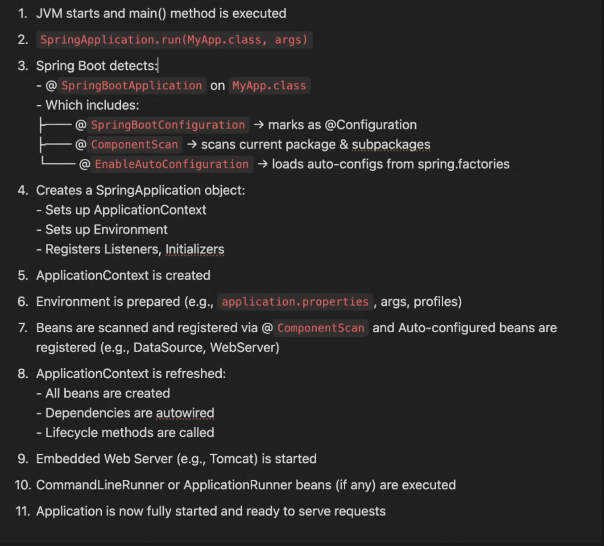

# SPRING

## Old ways

- web servlet
- web.xml
- usage of new keyword
- tightly coupled
- Cant mock in testing properly

## Spring Framework

IOC: Inversion of control
DI: Dependency Injection

- Loose Coupling
- Better Testing
- JakartaEE

EventDriven programming ??

### Components

- Core
- AOP
- JDBC
- WebMVC
- Testing

## Spring Boot

- Starter Dependency
- Dependency management
- Auto Configuration (Convention over Configuration)
- Embedded Server
- Externalized Configuration
- Build in metrics and HealthChecks

Request Handling
Request -> Servlet Container (Tomcat)
-> Dispatcher Servlet
-> Handler Mapping
-> Choose Handler
-> Handler Adaptor
-> Controller Method
-> Process Request
-> Response

If UI (Response == view name)
-> View name
-> Handler Adaptor
-> View Resolver
-> View

If JSON ((Response == Object))
-> Object
-> Handler Adaptor
-> Wrap into Response Entity, if not already
-> JSON serialization
-> return JSON

HTTPServletRequest
HTTPServletResponse
HTTPMessageConvertor

Presentation (controller)
Service
Persistence (repository)

Config
Controllers
DTO
Services
Entities
Repositories
Utils
Commons

## Configuration

Very important


THere are different PropertySource
(precedence is already defined)

https://docs.spring.io/spring-boot/appendix/application-properties/index.html

Application.properties
Application-{profile}.properties
<>.env
<>.xml
ENVIRONMENT_VARIABLE
etc

spring.profile.active => to set the active profile

```
debug=true
spring.profile.active=<profile_name>
```

## Maven

- See #3 of SJ (4th in playlist)
- CS -1.7

## Annotations

- @SpringBootApplication
- @SpringBootConfiguration
- @EnableAutoConfiguration
- @ComponentScan

- @RestController
- @Controller
- @ResponseBody

- @RequestMapping - GET, POST, PUT, PATCH, DELETE

- @RequestParam (name , required)
- @PathParam
- @RequestBody
- @InitBinder - PropertyEditor

- @Component
- @Service
- @Repository
- @RestController
- @Controller

- @Autowired
- @Configuration
- @Bean

- @PropertySource
- @Qualifier
- @Profile
- @Primary
- @Value("${property.name}")

- @Conditional
- @ConditionalOnProperty
- @ConditionalOnExpression
- @ConditionalOnClass
- @ConditionalOnJava
- @Conditional ....
- Custom Condition annotation (And and Or is also supported)

- @Lazy (class, field)

- @Enumerated(EnumType.ORDINAL/STRING)
- How is enum handled ???
- MethodArgumentTypeMismatchException

## Response

- ResponseEntity
  - body
  - header
  - status

## Bean

- Spring Managed Objects.

### Define Bean

- @ComponentScan -> Stereotype annotation
- @Configuration -> @Bean

- Initialization
  - Eager - Default for Singleton
    - use @Lazy for defer initialization of singleton
  - Lazy - Default for all other

### Scope

- Singleton (Default)
- Prototype
- Request - (can use proxy / dummy object at the time of creation - anti pattern)
- Session
- Websocket
- Application

### Bean Lifecycle

- Logic of bean creation
- Bean Dependency graph
  -> Creation based on Topological sort
  -> DI based on Topological sort
  -> Bean Initiated
  -> Bean in usage
  - Bean Destroyed
    @PostConstruct -> Bean Initiated
    @PreDestroy -> Bean Destroyed

### Bean Injection

- Constructor
  - Fail fast: error if dependency is missing
- Setter
- Field

#### Problem

- Circular
  - Code refactor
  - @Lazy with @Autowired (anti-pattern)
  - use @PostConstruct (anti-pattern)
- Unsatisfied
  - Do not have required depedent beans
  - More than one bean is available(ambiguous)

## AOP (Aspect Oriented Programming)

## // Revisit it again

Cross cutting concern -> affects multiple module

Validation
Logging
Transaction management
Security

- Aspect - Concern
- Pointcut - Where advice should be applied, which Method

  ## // Revisit it again

  - execution
  - within
  - @annotation
  - args
  - etc
    can be used with && ||
    can be named or inline

- Advice - Code that will be executed
- Join point - When advice should be applied,
- Weaving

@Aspect
@PointCut -> Named Pointcut

@Before
@After - after method completion or exception
@AfterReturning
@AfterThrowing
@Around

JoinPoint
ProceedingJoinPoint

Done using Proxy class (Decorator ???)
child class with overridden method

## JPA

Driver -> JDBC -> JPA provider

## Rest Client

## Test

## Other

Command line runner
Context
ApplicationContext
RequestContext
Session Context
